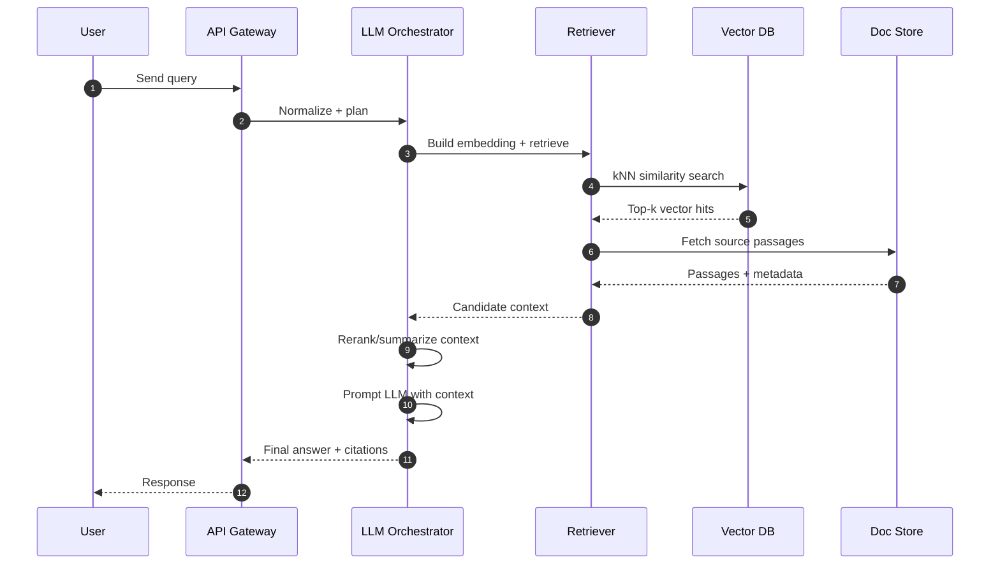

# AuraRAG Architecture (Draft)

Note: The only available source is a PDF (`nexus_rag_architecture_pdf_d8jV (1).pdf`). I couldn't extract text from it in this environment. The Mermaid diagrams below are templates aligned with a typical RAG system. Replace placeholders to match the PDF.

How to use:
- Edit component names to reflect the PDF.
- Preview Mermaid in GitHub, VS Code (Markdown Preview Mermaid Support), or Mermaid Live Editor.

## System Overview

```mermaid
flowchart LR
    subgraph Ingestion
        A[Connectors (Files, Web, DB)] --> B[Chunker]
        B --> C[Embeddings Generator]
        C -->|vectors| D[(Vector DB)]
        B -->|metadata| E[(Document Store)]
    end

    subgraph Query Path
        Q[User Query] --> QN[Query Normalizer]
        QN --> QE[Query Embedding]
        QE --> R{Retriever}
        R -->|kNN| D
        R -->|docs| E
        D --> CTX[Context Builder]
        E --> CTX
        CTX --> LLM[LLM Orchestrator]
        LLM --> RESP[Response]
        RESP --> U[User]
    end

    subgraph Optional Enhancements
        RR[Re-ranker] --- R
        TOOLS[Tools/Functions] --- LLM
        OBS[Tracing/Telemetry] --- LLM
    end

    style D fill:#e6f7ff,stroke:#39c
    style E fill:#fff7e6,stroke:#c93
    style LLM fill:#f0f5ff,stroke:#69c
```

## Request Sequence



## Ingestion Pipeline

```mermaid
flowchart TD
    SRC[Sources (SharePoint, Confluence, Git, DB)] --> EXT[Extract]
    EXT --> CH[Chunk]
    CH --> META[Enrich Metadata]
    CH --> EMB[Generate Embeddings]
    EMB --> VDB[(Vector DB)]
    META --> DST[(Document Store)]
```

## Notes to Align With PDF
- Replace component labels (e.g., API Gateway, Orchestrator, Vector DB) with the names used in your document.
- If the PDF defines security, tenancy, or deployment layers, add subgraphs (e.g., Frontend, Backend, Data Layer, Observability).
- If there is a feedback loop or evaluation, add a path from Response back to Ingestion or a separate Evaluation module.

## Source
- `nexus_rag_architecture_pdf_d8jV (1).pdf`
