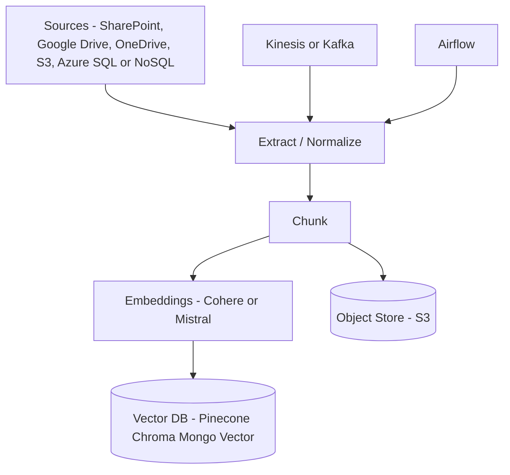
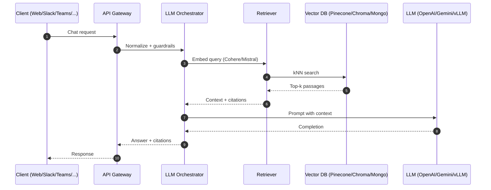

# Nexus – Full Architecture (Tech-Stack Aligned)

This design reflects the technologies mentioned in `docs/1stseptnexusproject.txt` and organizes them into a production-ready architecture for a RAG/GenAI system.

## High-Level Overview
- Clients: Web, Mobile, Slack, Microsoft Teams, WhatsApp, Telegram
- API/Backend: Single gateway providing chat API, file upload, admin RBAC
- Orchestration: Request planning, prompt assembly, tool use, guardrails
- Retrieval: Query embeddings, vector search (kNN), context building
- LLM: Hosted APIs (OpenAI, Gemini) or self-hosted via vLLM (Llama/Mistral)
- Ingestion: Connectors (SharePoint, Google Drive, OneDrive, S3), ETL, chunking, embeddings, storage
- Storage: Vector DB (Pinecone/Chroma/Mongo Vector), documents/artefacts in S3
- Streaming & Scheduling: Kafka/Kinesis, Airflow
- Observability: Prometheus + Grafana
- Infra: Kubernetes (EKS), AWS as primary, Azure optional

## Detailed Components
- Channels
  - Web and Mobile apps for end users
  - Slack, MS Teams, WhatsApp, Telegram bots for conversational entry points
  - Admin Dashboard for RBAC, usage controls, connector management
- API / Backend
  - Exposes chat/ingestion/admin endpoints
  - Integrates with observability (Prometheus metrics) and audit logs
- Orchestrator
  - Normalizes queries, handles guardrails, builds prompts with retrieved context
  - Chooses LLM provider (OpenAI/Gemini) or routes to vLLM for local/open-source models
- Retrieval
  - Embeddings: Cohere or Mistral models
  - Vector search: Pinecone, Chroma, or MongoDB vector search
  - Context builder: assembles passages and citations
- LLM Layer
  - OpenAI GPT or Google Gemini via API
  - vLLM server to host Llama/Mistral for data locality or cost control
- Ingestion
  - Sources: SharePoint, Google Drive, OneDrive, S3, Azure SQL/NoSQL
  - Pipeline: Extract → Normalize → Chunk → Embeddings → Store vectors/docs
  - Scheduler: Airflow for orchestrating periodic/adhoc ingestions
  - Streaming: Kafka or AWS Kinesis for near-real-time updates
- Storage
  - Vector DB: Pinecone/Chroma/Mongo (choose one primary; keep others optional)
  - Object store: S3 for raw files, chunks, artefacts
- Observability
  - Prometheus for metrics collection; Grafana dashboards
- Deployment
  - Kubernetes (EKS), horizontal scaling by component (API, Orchestrator, vLLM, Workers)

## Suggested Defaults
- Primary cloud: AWS (EKS + S3)
- Vector DB: Pinecone (managed) or Chroma (self-managed) depending on ops maturity
- Embeddings: Cohere for API simplicity and reranking; keep Mistral as alternate
- LLMs: Start with OpenAI GPT; add Gemini; run vLLM for Llama/Mistral where needed
- Streaming: Kinesis on AWS; Kafka if already adopted
- Scheduler: Airflow

## Mermaid Diagrams

### Architecture Overview
```mermaid
flowchart LR
    subgraph Clients
        WEB[Web App]
        MOB[Mobile App]
        SLK[Slack]
        TMS[MS Teams]
        WSP[WhatsApp]
        TLG[Telegram]
        ADM[Admin Dashboard RBAC]
    end

    GATE[API Gateway and Backend] --> ORCH[LLM Orchestrator]

    subgraph Ingestion
        SRC[Sources - SharePoint, Google Drive, OneDrive, S3, Azure SQL or NoSQL]
        STRM[Kinesis or Kafka]
        AFLW[Airflow]
        EXT[Extract and Chunk]
        EMB[Embeddings - Cohere or Mistral]
        VDB[(Vector DB - Pinecone Chroma Mongo Vector)]
        DSTORE[(Object Store - S3)]
        SRC --> EXT --> EMB --> VDB
        EXT --> DSTORE
        STRM --> EXT
        AFLW --> EXT
    end

    ORCH --> QEMB[Query Embedding - Cohere or Mistral]
    QEMB --> RET{Retriever}
    RET -->|kNN| VDB
    VDB --> CTX[Context Builder]
    CTX --> LLM[LLM Layer - OpenAI Gemini Llama Mistral API or vLLM]
    LLM --> RESP[Response and Citations]

    subgraph Observability
        PRM[Prometheus]
        GRF[Grafana]
    end

    subgraph Infra
        K8S[Kubernetes (EKS)]
        S3[(S3)]
    end

    WEB --> GATE
    MOB --> GATE
    SLK --> GATE
    TMS --> GATE
    WSP --> GATE
    TLG --> GATE
    ADM --> GATE
    RESP --> GATE

    GATE --- PRM
    ORCH --- PRM
    LLM --- PRM
    PRM --- GRF

    
```

### Ingestion Pipeline


### Request Sequence


## Operational Notes
- Start with one primary choice per category (e.g., Pinecone + Cohere + OpenAI + EKS + S3) and add alternates as adapters for portability.
- Use Airflow/Kinesis for change-data-capture or near-real-time document updates.
- Export metrics from API/Orchestrator/Vector/LLM components to Prometheus; build Grafana dashboards for latency, token usage, errors, throughput.
